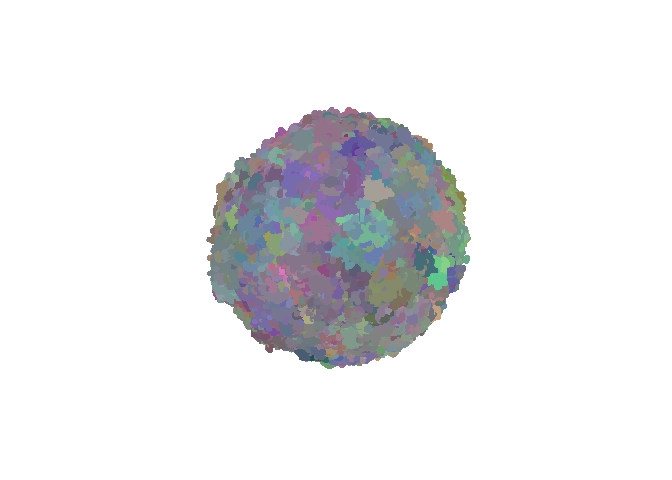
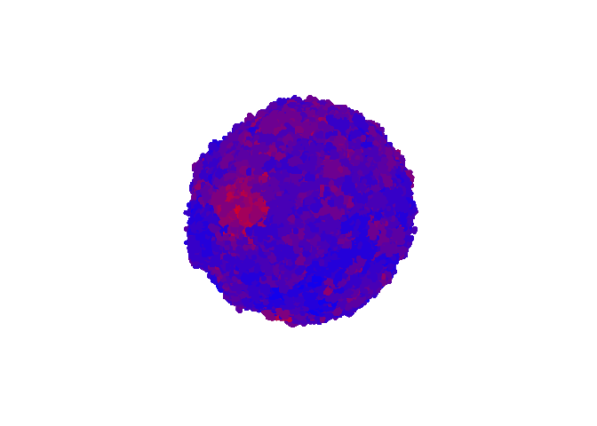

[](https://travis-ci.org/phillipnicol/SITH)
[](https://cran.r-project.org/package=SITH)
[](https://CRAN.R-project.org/package=SITH)

A Spatial Model of Intra-Tumor Heterogeneity (SITH)
================
R package version 1.0.1.0 (1.0.1 on CRAN). 

## Installation

The following is required for installing the package:

  - `R` version 3.6.0 or newer.
  - Package `Rcpp` which can be downloaded from CRAN by running
    `install.packages("Rcpp")` from the console.
  - Package `rgl` is **strongly recommended** for visualizations can be
    downloaded from CRAN by running `install.packages(rgl)` from the
    console.
      - macOS users may have to install
        [Xquartz](https://www.xquartz.org) before installing `rgl`.

See the package documentation for a complete list of dependencies.

The official release is on CRAN, and can be installed by running `install.packages(SITH)` from the command line. 

The newest version of the package can be installed directly from this
repository by first installing `devtools` (run
`install.packages(devtools)`) and then running
`install_github("phillipnicol/SITH")` from the console.

## Reference manual and vignette 
Refer to the [official CRAN page](https://CRAN.R-project.org/package=SITH) to view the package vignette and reference manual.  

## Features

  - Contains a 3D simulator of spatial tumor growth and mutation,
    similar to the model described in [this
    paper](https://www.nature.com/articles/nature14971).
      - The main simulations are in C++ for performance. 
      - A tumor with 1 million cells can be simulated in under a minute
        on a standard desktop computer.
  - 3D interactive visualizations of the simulated tumor using `rgl`.
      - Option to color regions with high mutation red and regions with
        low mutation blue.
      - 2D cross section
  - Summary of the spatial distribution of mutations throughout the
    tumor.
      - Creates graphs that show how genetic diversity changes in
        different spatial regions.
  - Create synthetic bulk and single-cell sequencing data from the
    simulated tumor.
      - Users can specify what part of the tumor the samples are taken
        from.
        
## Planned extensions 

  - Metastatic seeding.
  - Simulation of therapeutic and surgical procedures.
  - Multi-type branching process on the lattice 

## Demo

``` r
set.seed(1126490984)
library(SITH)
library(rgl)
```

Generate a tumor with 1000000 cells:

``` r
out <- simulateTumor(N = 1000000, verbose = FALSE)
```

Visualize the tumor with each unique allele colored differently:

``` r
visualizeTumor(out, background = "white")
rgl::view3d(zoom = 0.66)
```

<!-- -->

Color regions of low mutation blue and regions of high mutation red:

``` r
visualizeTumor(out, background = "white", plot.type = "heat")
rgl::view3d(zoom = 0.66)
```

<!-- -->


